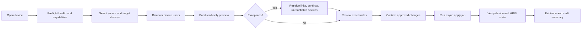

# PRD — Admin Device Enrollment and Reconciliation

## Product Vision

An administrator should be able to make device identity changes with the same confidence as a controlled data migration: know the starting state, see the proposed writes, resolve exceptions, approve the exact scope, and prove the ending state.

## Personas

- **HRIS admin** — links a terminal identity to an employee and enrolls a person to a device.
- **Device admin** — reconciles multiple terminals, investigates unreachable devices, and verifies convergence.
- **Operations reviewer** — needs a durable run summary and evidence without repeating the operation.

## Ordered User Journey

## User Stories

- As an admin, I can see whether a device is reachable before I start.
- As an admin, I can preview proposed changes without mutating data.
- As an admin, I can distinguish exact matches, unmatched users, ambiguous matches, conflicts, and missing peer users.
- As an admin, I can choose source A, source B, keep existing, or leave unresolved for every conflict.
- As an admin, I cannot apply while required decisions remain unresolved.
- As an admin, I can watch, cancel, and later reopen a sync job.
- As an admin, I can verify what was actually persisted and what remains divergent.

## Functional Requirements

### FR-01 Entry and scope

The entry surface identifies the selected device, vendor, environment, last sync, and available actions. The admin can choose one source and one or more targets for reconciliation.

### FR-02 Preflight

Run read-only health/capability checks. Show reachable/unreachable status, vendor, address, user count when available, event count when available, credential/SDK errors, and last successful sync.

### FR-03 Preview

Use a preview mode or plan endpoint. Present counts for union users, conflicts, missing-on-target, ambiguous matches, missing HRIS links, unreachable devices, and planned writes.

### FR-04 Review and resolution

Use a filterable table with status chips and expandable detail. Conflict rows must show both device records, field-level differences, and explicit choices: Source A, Source B, Keep existing. Unmatched rows offer Link employee, defer, or exclude from this run.

### FR-05 Apply guard

The primary apply action is disabled until all required decisions are resolved. Confirmation names the source, targets, number of writes, unresolved exceptions, and irreversible/high-risk implications.

### FR-06 Job progress

Start the existing sync/enrollment job, poll or subscribe to progress, show determinate counts where known, and allow cancellation. Preserve the job ID and run summary.

### FR-07 Verification

After apply, refresh device users and HRIS links. Show applied, skipped, failed, and still-divergent records, with links to sync history and retry guidance.

### FR-08 Safety and audit

Record actor, timestamp, source/target devices, preview ID, choices, job ID, results, and errors. Never render raw biometric templates.

## Non-Functional Requirements

- Admin-only route and existing `hris-admin` authorization model.
- WCAG 2.2 AA intent: keyboard operation, visible focus, semantic table headers, live progress announcements, and error summary plus inline errors.
- Preserve URL state for selected device, panel, filter, and job where practical.
- Long-running operations must survive tab refresh by reopening the job.
- Avoid claiming success from a local API response alone; deployment proof must identify LAN/VM/GitOps/public boundaries.

## Acceptance Criteria

1. Given a reachable device, an admin can complete preview → resolve → apply → verify without navigating through unrelated screens.
2. Given conflicts, Apply remains unavailable until each required conflict has a choice.
3. Given an unreachable target, the UI clearly marks the run as partial/blocked and does not claim convergence.
4. Given a failed job, the UI retains the job summary, failure reason, completed writes, and safe retry path.
5. Given refresh during a job, the user can reopen the job and see current progress.
6. Playwright proves the critical read-only journey with network evidence and a screenshot.

## Implemented UI Direction — 2026-07-13

The Sync Center remains the summary-first entry point. The detailed user journey starts only after the admin clicks the existing Sync Center/device-user action. The overview keeps the device summary and counts visible; detailed merge/link/refresh controls stay inside the opened workflow to avoid mixing global status with per-device decisions.

## Current API Evidence Map

The frontend service already exposes: `GET /api/device/sync-preview`, `GET /api/device/:id/users`, `POST /api/device/:id/users/sync`, sync jobs under `/api/device/users/sync-jobs`, merge plan/apply under `/api/device/hikvision/sdk-users/merge/{plan,apply}`, link/unlink endpoints, and `POST /api/device/enroll`.

## Open Questions / NEEDS_CONFIRMATION

- Whether a single canonical preview endpoint should cover all vendors or whether vendor-specific adapters remain.
- Whether peer convergence is allowed to write biometric metadata in the first release.
- Whether job progress is polling-only or can use an existing socket event.
- GitOps/K3s promotion proof for this branch remains separate from local implementation proof.

## Research Basis

- Carbon recommends progress bars for system operations, determinate when measurable and indeterminate when not; it also recommends keeping status text close to the indicator.
- Carbon progress indicators model complete/current/not-started/error states and keep step labels short.
- GOV.UK’s “check answers” pattern places a review step immediately before confirmation to reduce errors.
- GOV.UK’s multi-task pattern pairs a visible task status with an error summary and inline error at the point of failure.

Sources: [Carbon progress bar usage](https://carbondesignsystem.com/components/progress-bar/usage/), [Carbon progress indicator](https://carbondesignsystem.com/components/progress-indicator/style/), [GOV.UK check answers](https://design-system.service.gov.uk/patterns/check-answers/), and [GOV.UK complete multiple tasks](https://design-system.service.gov.uk/patterns/complete-multiple-tasks/).
