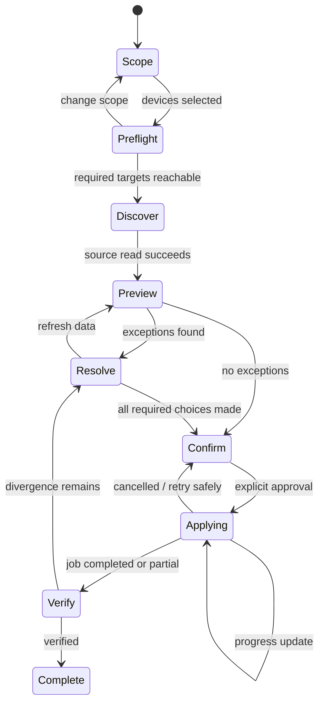

# Device Enrollment User Journey and Architecture Visualization

## Journey Map

| Stage | Admin question | UI output | Safe system action |
|---|---|---|---|
| Scope | What am I changing? | Source/target devices, vendor, environment | Read device metadata |
| Preflight | Can the devices respond? | Reachability, capabilities, last sync | Read health/capability |
| Discover | What exists on each device? | Counts and source records | Read users |
| Review | What differs? | Preview counts, filters, diff rows | Build plan, no writes |
| Resolve | What should happen to exceptions? | Explicit link/conflict choices | Store decisions locally |
| Confirm | What exactly will be written? | Check-answers summary | Revalidate preview |
| Apply | Is the job progressing? | Job ID, progress, cancel | Execute approved writes |
| Verify | Did reality converge? | Applied/failed/divergent report | Re-read device and BNPI PATS |

## State Visualization



## Visual Direction

Restrained operational UI: neutral canvas, strong typography, one accent for the current step, semantic green/amber/red status, and no decorative gradients. The surface should feel like an instrument panel in a quiet operations room: focused, reviewable, and trustworthy.

## Component Wireframe

```text
┌─────────────────────────────────────────────────────────────┐
│ Devices / Main Entrance                         [Exit]       │
│ Scope — Review — Resolve — Apply — Verify                    │
├───────────────┬───────────────────────────────┬─────────────┤
│ Step guidance │ Main task                      │ Run summary │
│               │ 2 devices selected             │ 2 reachable │
│               │ [Preview result / review table]│ 18 changes  │
│               │ filters  search  status        │ 3 conflicts │
│               │ rows with expand + resolve     │ 1 warning   │
├───────────────┴───────────────────────────────┴─────────────┤
│ [Back]                                      [Continue]       │
└─────────────────────────────────────────────────────────────┘
```

