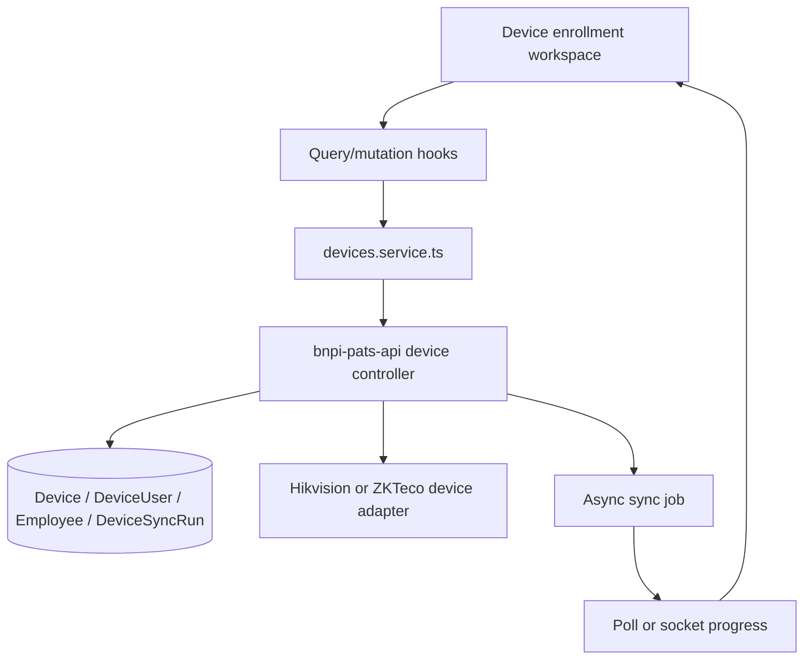

# Frontend Architecture Truth — Device Enrollment and Reconciliation

## Truth Status

**CONFIRMED:** React Router route surface in `bnpi-pats-app`; `devices.service.ts` contains the device-user, sync-job, merge-plan/apply, link/unlink, and enrollment contracts; backend controller/helper own device persistence and merge planning.

**INFERRED:** The safest UX boundary is a stateful orchestration screen that composes existing service calls rather than moving merge logic into the browser.

**NEEDS_CONFIRMATION:** Final K3s/GitOps deployment behavior and whether live socket events are available for every job type.

## Architecture Summary



## Module Boundaries

- `DeviceEnrollmentWorkspace`: orchestration, URL state, step state, guard rails.
- `DevicePreflight`: health, capabilities, selected source/targets.
- `DeviceSyncPreview`: counts and diff summary; read-only.
- `DeviceUserReviewTable`: filtering, pagination, row expansion, status semantics.
- `DeviceConflictResolver`: field-level choices; no identity heuristics.
- `DeviceApplyConfirmation`: exact-scope confirmation and warnings.
- `DeviceJobProgress`: polling/subscription, cancellation, refresh recovery.
- `DeviceVerificationReport`: post-apply comparison and evidence links.
- `devices.service.ts`: transport and response normalization only.
- Backend merge helper/controller: identity grouping, conflict calculation, and persistence authority.

## State Model

```ts
type EnrollmentStage =
  | "scope" | "preflight" | "discover" | "preview"
  | "resolve" | "confirm" | "applying" | "verify" | "complete";

type EnrollmentRunState = {
  stage: EnrollmentStage;
  sourceDeviceId: string | null;
  targetDeviceIds: string[];
  previewId: string | null;
  choices: Record<string, Record<string, "A" | "B" | "KEEP">>;
  deferredKeys: string[];
  jobId: string | null;
  verification: unknown | null;
};
```

Use server state as truth. Keep only transient selection and explicit decisions in local state; never cache raw templates or invent client-side merge results.

## Data Flow and Guard Rails

1. Query device and health data.
2. Call preview/plan endpoint with `execute=false` or documented preview equivalent.
3. Render server-provided counts and records.
4. Collect explicit decisions.
5. Revalidate preview before apply if stale.
6. Submit exact preview ID plus choices.
7. Track job.
8. Re-fetch and compare after completion.

## UX Composition

Use a vertical progress indicator for the five major stages: Scope, Review, Resolve, Apply, Verify. Keep the main content to a readable two-thirds column with a persistent right-side “Run summary” on wide screens; collapse it above the primary action on small screens. Use tables for repeatable records, summary cards for counts, inline errors plus an error summary, and a sticky footer for Back/Continue/Apply.

## Error and Resilience Rules

- 401/403: stop and explain admin access is required.
- Device unreachable: preserve preview if available, mark target unavailable, block convergence claim.
- Stale preview: require refresh, do not silently apply old decisions.
- Partial job: show completed/failed/skipped separately.
- Cancelled job: retain evidence and provide safe retry.
- Unknown progress: use indeterminate progress and plain-language status.

## Performance and Accessibility

Virtualize or paginate large user lists; do not render thousands of expanded rows. Keep progress labels stable and put counts in helper text. Use `aria-live` for job transitions, focus the error summary on validation failure, and preserve keyboard access to row expansion and conflict choices.

## Test Strategy Alignment

- Unit: mapping of API response states to stage/status labels.
- Component: conflict choice completeness and Apply guard.
- Service: request/response normalization and error mapping.
- Playwright: admin login, open device, read-only preview, conflict/review visibility, and screenshot/network evidence.
- Runtime: direct API proof before browser proof; LAN/VM/GitOps status called out separately.

