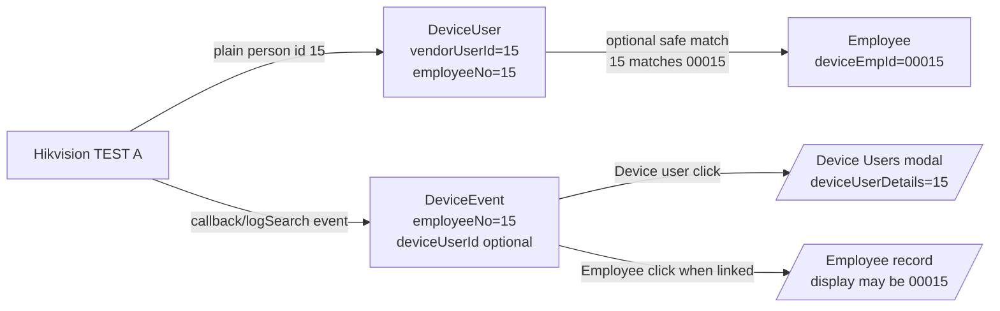
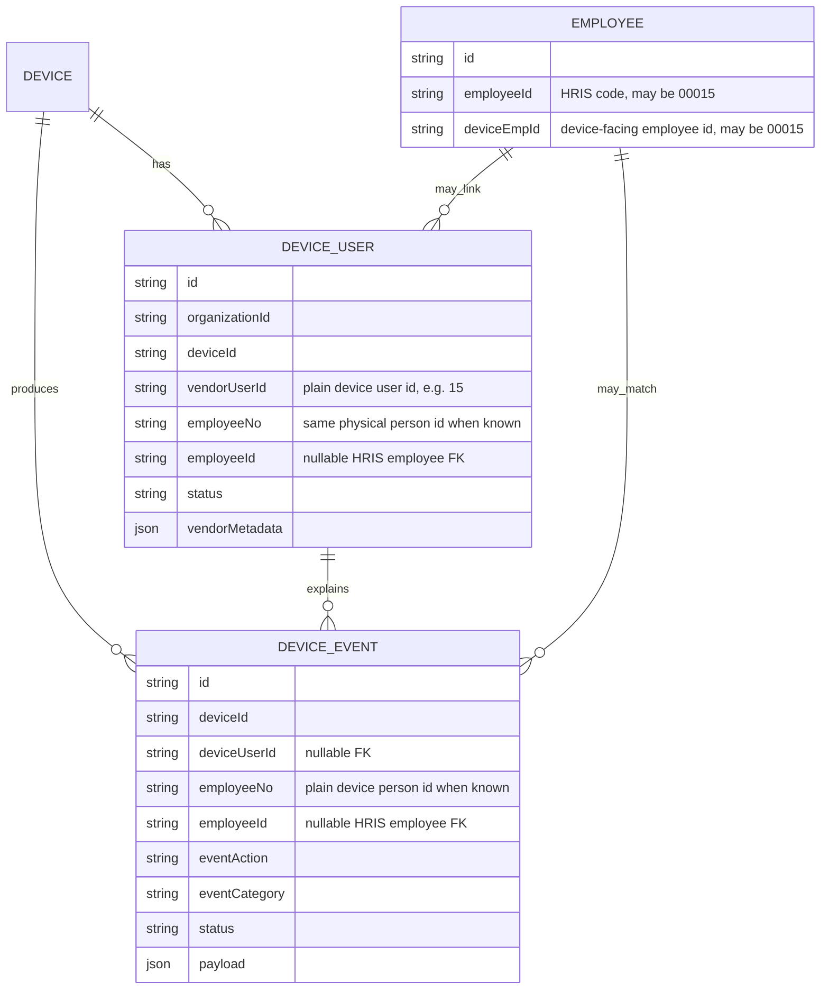

# Hikvision enrollment identity flow (spec + architecture)

**Status:** ACCEPTED local runtime design (2026-07-19)  
**Task mode:** Docs / architecture sync (matches code + live TEST A evidence)  
**Audience:** operators, agents, and implementers working Device Events / Device Users / SDK listener  

This document captures **what you want**, **what the architecture is**, **what the code does today**, and **how to verify the flows stay in sync**.

---

## 1. What you want (operator vision)

**Source of truth for live events:** HCNetSDK **listener callback only**  
(`POST /api/hikvision/callback`). Not a product poller inventing people.

Three Hikvision → HRIS event families:

| Operator name | Hikvision reality | HRIS action |
|---|---|---|
| **onUserCreate** | User add on panel (op / `addUserInfo` / major=3 then leaf) | DeviceEvent `USER_CREATED` + **DeviceUser** + raw metadata |
| **onEnrollUser** | Fingerprint enroll (`addFp…` / FP management) | DeviceEvent `FINGERPRINT_ENROLLED` + DeviceUser credential refresh |
| **onAttendanceTap** | Access auth pass (major=5) | DeviceEvent `TAP` + Attendance if employee linked |

### Identity model (your pattern — must not collapse)

```text
Device panel person number ..............  15
DeviceUser.vendorUserId / employeeNo ....  15     ← same plain id + raw UserInfo
DeviceEvent.employeeNo (resolved) .......  15
Employee.deviceEmpId ....................  00015  ← 5-digit pad for HRIS match
Employee.employeeId .....................  often 00015 (org code / display)
Op log opaque token .....................  QVEwgvx/…==  (never show as person no.)
```

```text
┌──────────────────────────────────────────────────────────────────────────┐
│ Physical device (Hikvision panel)                                        │
│   Plain person id:  "15"          ← typed/created on terminal            │
│   Op log may store: opaque token  ← LogAddInfo.EmployeeNo (not readable) │
└──────────────────────────────────────────────────────────────────────────┘
                │                                      │
                ▼                                      ▼
┌─────────────────────────────┐          ┌─────────────────────────────────┐
│ DeviceUser (HRIS inventory) │          │ DeviceEvent (ledger history)    │
│ vendorUserId / employeeNo   │◄─────────│ employeeNo = plain "15" when    │
│   = "15"                    │  link    │   resolved                      │
│ rawPayload + vendorMetadata │          │ deviceUserId → DeviceUser       │
│ employeeId → Employee (opt) │          │ payload.opaquePersonToken kept  │
└─────────────────────────────┘          └─────────────────────────────────┘
                │
                │ link when deviceEmpId / employeeId matches pad variants
                ▼
┌─────────────────────────────┐
│ Employee (HRIS person)      │
│ deviceEmpId: "00015"        │  ← 5-digit pad of device person "15"
│ employeeId:  org code       │  ← often also "00015"
└─────────────────────────────┘
```

| Concept | Canonical field | Example | UI click target |
|---|---|---|---|
| Device plain person id | `DeviceUser.vendorUserId` / event `employeeNo` | `15` | Device Users details (`deviceUserDetails=15`) |
| Opaque log token | `payload.opaquePersonToken` / `DevicePersonToken` | `QVEwgvx/WIX5uNj9psBnjw==` | Never show as “employee no.” |
| HRIS employee device link | `Employee.deviceEmpId` | `00015` | Employee record (when matched) |
| HRIS employee business code | `Employee.employeeId` | often `00015` | Employee record |

**Pad rule:** pure-numeric device person ids match HRIS via variants  
`15` ↔ `00015` (from `buildDeviceUserEmployeeNoCandidates`).

**Visual HTML cards (open in browser):**  
[`docs/hikvision-callback-event-flows.html`](./hikvision-callback-event-flows.html)

### onUserCreate — required must-happen list

When person **15** is created on **one** device (e.g. TEST A):

1. **Callback** receives create (direct ACS or major=3 → logSearch `addUserInfo` on the callback path).
2. **DeviceEvent** `USER_CREATED` with plain `employeeNo = "15"` once resolved.
3. **DeviceUser upsert** for that device:
   - `vendorUserId = "15"`, `employeeNo = "15"`
   - **raw metadata**: `rawPayload` + `vendorMetadata` from UserInfo/Search
4. **Employee match:** if `Employee.deviceEmpId` (or `employeeId`) is in pad set of `15` (includes **`00015`**):
   - set `DeviceUser.employeeId` + event `employeeId` → **MATCHED / ACTIVE**
5. If no such Employee: DeviceUser **UNMATCHED**; UI still shows **User 15** (device person).
6. **Socket** `device-event:saved` so Device Events updates live; deep-link opens Device User `15`.

---

## 2. Architecture (correct layers)

```text
 Windows host                              Hyper-V VM                         Hikvision device
 ────────────                              ──────────                         ────────────────
 npm run dev / Keep-ready
   │
   ├─ smart reverse-bridge resolve
   │    DB Device row (TEST A)
   │    + host TCP reachability
   │    → 192.168.254.102
   │
   ├─ SSH reverse (device)
   │    VM:59000 → host → device:8000 (SDK)
   │    VM:59443 → host → device:443  (HTTPS/ISAPI)
   │
   └─ SSH reverse (API socket truth)
        VM:53001 → host:3001

                                         hikvision-biometric-service
                                         (HCNetSDK alarm listener)
                                              │
                                              │ ACS alarm callback
                                              │ major/minor + optional dwEmployeeNo
                                              ▼
                                         POST /api/hikvision/callback
                                         source=EN_HCNETSDK_ALARM
                                              │
                    ┌─────────────────────────┼─────────────────────────┐
                    ▼                         ▼                         ▼
            Save DeviceEvent           Fast identity path          Multipass follow-up
            (always, socket)           (if plain/opaque known)     (if major=3 empty person)
                    │                         │                         │
                    │                         ├─ DeviceUser stub        ├─ logSearch leaves
                    │                         ├─ MATCHED/UNMATCHED      │   USER_CREATED / FP
                    │                         ├─ socket again           ├─ opaque tokens
                    │                         └─ UserInfo enrich        └─ inventory delta
                    │                                                    → plain + DeviceUser
                    ▼
            Browser Device Events
            device-event:saved  (Socket.IO)
```

### What is **not** the architecture

| Misread | Reality |
|---|---|
| “Polling invents enroll people” | No. Live path is **SDK ACS alarm → callback**. Multipass logSearch / inventory is **follow-up evidence** when the SDK packet has no plain person id. |
| “Opaque token = employee number” | No. Opaque tokens are log privacy ids; plain id lives in **UserInfo/Search**. |
| “DeviceUser is the event ledger” | No. **DeviceEvent** = history. **DeviceUser** = current inventory on device. |
| “Listener green = employee matched” | No. Listener green = transport/SDK armed. Matching is a separate HRIS link step. |
| “Host reverse tunnel = VM can ping device LAN” | No. Reverse only exposes chosen TCP ports on VM loopback. |

This matches Project Truth principles: **DeviceEvent is saved event truth; DeviceUser is inventory; evidence over assumption.**

---

## 3. Exact event flows (spec to code)

### Flow A — SDK callback already carries plain person id

**When:** ACS alarm includes `dwEmployeeNo > 0` (or typed action with plain `employeeNo` / `employeeNoString`), e.g. some user-management minors.

```text
SDK alarm (employeeNo="15")
  → POST /api/hikvision/callback
  → save DeviceEvent (taxonomy USER_CREATED / FP / …)
  → applyFastEnrollmentIdentityOnSdkCallback
       1) upsert DeviceUser vendorUserId=15 (+ HRIS link 15↔00015 if employee exists)
       2) set event.employeeNo=15, deviceUserId, MATCHED|UNMATCHED
       3) emit device-event:saved   ← socket #1 (plain id now)
       4) background UserInfo/Search → DeviceUser.rawPayload/vendorMetadata
          emit device-event:saved again ← socket #2 (richer metadata)
```

**Code owners**

| Step | Location |
|---|---|
| SDK JSON body | `vendor/hikvision-linux/hikvision_biometric_service.cpp` (`build_hikvision_callback_json`) |
| Callback + non-attendance branch | `hris-api/app/hikvision/controller/callback.controller.ts` |
| Fast identity | `applyFastEnrollmentIdentityOnSdkCallback` in `hris-api/helper/device-person-token.helper.ts` |
| DeviceUser UserInfo enrich | `enrichEnrollmentLifecycleEvent` same helper |
| Socket | `emitDeviceEventSaved` → `device-event:saved` |

**Acceptance (Flow A)**

- [ ] HTTP callback returns `enrollmentIdentityPath=plain_immediate` (or `opaque_mapped`) when plain available  
- [ ] DeviceEvent.employeeNo = plain `15`  
- [ ] DeviceUser.vendorUserId = `15`  
- [ ] Socket payload includes `event.employeeNo=15` and optional `event.employee` when linked  
- [ ] Device Events UI shows **User 15** (not “No person id”)  
- [ ] Device Users deep-link `deviceUserDetails=15` opens that row  

---

### Flow B — Panel enroll (common): SDK major=3 signal **without** plain id

**When:** Device fires operation-sync / major=3; first packet often has **empty** `dwEmployeeNo`. Panel create still writes UserInfo with plain `15`, but **operation logs** store an **opaque** token.

```text
SDK major=3 SYNC_SIGNAL (employeeNo empty)
  → POST /api/hikvision/callback
  → save DeviceEvent (RUNTIME / SYNC_SIGNAL) + socket (path alive)
  → scheduleOperationLogResolveAfterSdkSignal (multipass, ~0.2s–25s)
       │
       ├─ ISAPI ContentMgmt/logSearch leaves
       │    addUserInfo / addFpByEmployeeNo / …
       │    → typed DeviceEvent USER_CREATED / FINGERPRINT_ENROLLED
       │    → employeeNo often still EMPTY; payload.opaquePersonToken set
       │    → socket each new lifecycle row
       │
       └─ resolveOpaqueViaDeviceUserInventoryDelta
            UserInfo/Search (enough pages for 300+ users)
            new plains not in HRIS DeviceUser → upsert DeviceUser immediately
            1 opaque + new plain(s) → map highest pure-numeric plain (e.g. 15)
            DevicePersonToken(opaque → "15")
            backfill recent lifecycle events employeeNo=15 + deviceUserId
            enrich UserInfo onto DeviceUser
            socket updated rows
```

**Live evidence (TEST A, 2026-07-19)**

| Observation | Value |
|---|---|
| Panel person | `15` |
| Op log opaque | `QVEwgvx/WIX5uNj9psBnjw==` |
| ISAPI UserInfo | `employeeNo=15`, `numOfFP=1` |
| First events | USER_CREATED + FINGERPRINT_ENROLLED with opaque, no plain |
| After resolve/recover | `employeeNo=15`, DeviceUser `vendorUserId=15` |

**Acceptance (Flow B)**

- [ ] First socket within ~1s of SDK signal (may still say “No person id” briefly)  
- [ ] Typed USER_CREATED / FINGERPRINT_ENROLLED appear from logSearch (seconds)  
- [ ] Within inventory-delta window: DeviceUser `15` exists  
- [ ] Same window: events updated to plain `15` + re-socket  
- [ ] Opaque retained in payload for audit  

---

### Flow C — HRIS-initiated UserInfo write (write-time capture)

**When:** Admin/API creates user via `UserInfo/Record` with known plain id.

```text
POST UserInfo/Record (plain employeeNo known to HRIS)
  → scheduleWriteTimePersonTokenCapture
  → poll logSearch for opaque token
  → DevicePersonToken(opaque → plain) for future callbacks
```

Plain id is already known at write time — best case for “socket with person immediately” if a lifecycle event is also emitted.

---

### Flow D — Attendance tap (not enroll)

```text
SDK major=5 auth pass + employeeNo
  → callback attendance path
  → DeviceUser / deviceEmpId resolve
  → attendance / timesheet projection when matched
  → device-event:saved
```

Enroll identity rules still use the same person-id pad variants for matching.

---

## 4. Sequence diagram (panel enroll of person 15)

```mermaid
sequenceDiagram
  autonumber
  participant Panel as Hikvision panel
  participant SDK as HCNetSDK listener (VM)
  participant API as hris-api callback
  participant DB as Postgres
  participant UI as Device Events (browser)
  participant ISAPI as Device ISAPI

  Panel->>Panel: Create user 15 + enroll FP
  Panel->>SDK: ACS major=3 (often no plain id)
  SDK->>API: POST /api/hikvision/callback
  API->>DB: Insert DeviceEvent SYNC_SIGNAL
  API->>UI: device-event:saved (quick, person may be empty)

  API->>ISAPI: multipass logSearch (addUserInfo, addFp…)
  ISAPI-->>API: leaves with opaque token
  API->>DB: Insert USER_CREATED / FINGERPRINT_ENROLLED (opaque)
  API->>UI: device-event:saved (typed actions)

  API->>ISAPI: UserInfo/Search inventory
  ISAPI-->>API: plain employeeNo=15 (+ numOfFP)
  API->>DB: Upsert DeviceUser vendorUserId=15
  API->>DB: Map opaque→15; update events employeeNo=15
  API->>UI: device-event:saved (User 15)

  Note over UI: Click device person → Device Users details for 15<br/>Click employee (if linked) → HRIS employee 00015
```

---

## 5. Data contracts (sync checklist)

### DeviceEvent (ledger)

| Field | Enroll create/FP target |
|---|---|
| `eventCategory` | `USER_MANAGEMENT` / `ENROLLMENT` |
| `eventAction` | `USER_CREATED` / `USER_UPDATED` / `FINGERPRINT_ENROLLED` / … |
| `employeeNo` | **Plain** device person id when known (`15`) — never leave opaque here once mapped |
| `deviceUserId` | FK to DeviceUser when known |
| `employeeId` | FK to Employee when linked (`00015` deviceEmpId match) |
| `payload.opaquePersonToken` | Always keep if seen |
| `payload.resolvedEmployeeNo` | Plain after map |
| `payload.enrollmentSnapshot` / `enrollmentGoal` | Goal-oriented identity + UserInfo summary (no raw FP template bytes) |
| `status` | `MATCHED` if employee linked; else `UNMATCHED` / `RECEIVED` while resolving |

### DeviceUser (inventory)

| Field | Target |
|---|---|
| `vendorUserId` | Plain device id `15` |
| `employeeNo` | Same plain id |
| `rawPayload` | Last UserInfo/Search (or sync) body |
| `vendorMetadata` | Structured vendor summary + optional `opaquePersonToken` + biometric custody pointers |
| `employeeId` | Set when pad-aware link succeeds |

### DevicePersonToken (opaque map)

| Field | Target |
|---|---|
| `opaqueToken` | LogAddInfo token |
| `employeeNo` | Plain `15` |
| `source` | `WRITE_TIME_CAPTURE` / `PANEL_INVENTORY_DELTA` / … |

---

## 6. UI navigation contract

```text
Device Events row
  employeeNo plain "15" (or deviceUser.vendorUserId)
       │
       ├─ "Device user" control
       │     → /admin/configuration/devices?
       │          action=device-users
       │          &deviceId=<TEST A>
       │          &deviceUserSearch=15
       │          &deviceUserDetails=15
       │          &deviceUserView=shown   (Current view for brand-new plains)
       │
       └─ Employee name (only if employeeId linked)
             → employee profile for that HRIS id
             (display code may show 00015)
```

Do **not** use padded `00015` as `deviceUserDetails` — DeviceUser keys are **unpadded device plain ids**.

---

## 7. Runtime path prerequisites (TEST A reverse)

```text
Device row (source of config truth)
  name: TEST A
  address: 192.168.254.102
  transport: ssh-reverse-forward
  sdkPort: 8000
  https: 443

predev / Keep-ready
  resolve-hikvision-vm-bridge-targets.cjs
    → reverse devices from DB + host TCP rank
  ensure-hikvision-vm-bridge.cjs
    → local SSH must match resolved IP (not stale :59000 alone)
  ensure-device-live-path.ps1
    → API reverse VM:53001 → host:3001 (socket truth)
```

Listener modal **armed/receiving** proves transport. Person labels prove identity resolve.

---

## 8. Spec ↔ implementation sync matrix

| Spec intent | Implemented? | Primary code |
|---|---|---|
| SDK callback is the live enroll path | **Yes** | `hikvision_biometric_service.cpp` → `/api/hikvision/callback` |
| Quick socket on every saved event | **Yes** | `emitDeviceEventSaved` |
| Plain id on callback when SDK sends it | **Yes** | `applyFastEnrollmentIdentityOnSdkCallback` |
| Panel opaque → plain without inventing ids | **Yes** | logSearch + inventory delta |
| New plain lands on DeviceUser quickly | **Yes** (2026-07-19) | inventory delta upserts new plains before map completes |
| Pad `15` ↔ `00015` for Employee link | **Yes** | `buildDeviceUserEmployeeNoCandidates` + link helpers |
| Raw FP template bytes on DeviceEvent | **No (by design)** | encrypted DeviceUser custody only |
| Device Events click → Device User 15 | **Yes** | deep-link `deviceUserDetails` |
| Employee click → padded employee | **Yes when linked** | Employee.deviceEmpId / employeeId |
| Smart reverse IP after reboot | **Yes** | resolve targets + ensure bridge |
| Always sub-second plain person on panel create | **Partial** | depends on logSearch + UserInfo; often 1–10s after first socket |

---

## 9. Gaps / honest boundaries

1. **Panel create does not guarantee plain id on the first SDK packet.** Device firmware often sends major=3 without `dwEmployeeNo`. Spec accepts a short “path alive” row first, then plain id on resolve.
2. **If inventory delta cannot uniquely map opaque → plain** (many new users at once), events may stay opaque until Sync device users or a later delta.
3. **No Employee row with deviceEmpId `00015`** means DeviceUser stays **UNMATCHED** even when plain `15` is correct.
4. **Search box “15”** also matches `01515`, etc.; use `vendorUserId=15` or deep-link for exact open.
5. **Listener STATUS UNREACHABLE** in Sync Center vs green Device Events strip means two different status probes — do not treat them as the same truth without checking the same endpoint.

---

## 10. How to re-verify the vision end-to-end

```powershell
# 1) Health + login
# 2) Create person N on panel + enroll FP
# 3) Device Events: expect socket rows within seconds
# 4) API proof

$login = Invoke-RestMethod -Method Post 'http://localhost:3001/api/auth/login' `
  -ContentType 'application/json' `
  -Body (@{ email='admin@bandai.local'; password='password123'; appCode='hris' } | ConvertTo-Json)
$h = @{ Authorization = "Bearer $($login.data.token)" }

# Recent USER_CREATED for TEST A device id
Invoke-RestMethod -Headers $h -Uri 'http://localhost:3001/api/device/events?page=1&limit=5&eventAction=USER_CREATED&deviceId=<TEST_A_ID>'

# Exact DeviceUser
Invoke-RestMethod -Headers $h -Uri 'http://localhost:3001/api/device/<TEST_A_ID>/users?vendorUserId=15'

# Device still has plain 15
# POST /api/hikvision/access-control/user-info/search with EmployeeNoList employeeNo=15
```

**Pass criteria for one enroll**

1. Socket or refresh shows USER_CREATED and/or FINGERPRINT_ENROLLED.  
2. Within resolve window: `employeeNo` plain on those events.  
3. `GET .../users?vendorUserId=<plain>` returns one row.  
4. Device user deep-link opens that row.  
5. If Employee.deviceEmpId is padded form of plain, event/DeviceUser become MATCHED/ACTIVE.

---

## 11. Related docs & code map

| Doc / path | Role |
|---|---|
| This file | Enrollment identity **spec + diagrams** |
| `.wwg/wiki/05-architecture/hikvision-enrollment-identity-architecture.md` | WWG architecture twin |
| `.wwg/wiki/05-architecture/hikvision-biometric-sync-architecture.md` | Biometric peer-sync target architecture |
| `docs/HIKVISION_RUNTIME_TRUTH.md` | Broader runtime evidence |
| `hris-api/helper/device-person-token.helper.ts` | Opaque map, inventory delta, fast identity |
| `hris-api/helper/device-user-sync.helper.ts` | Pad candidates + link decision |
| `hris-api/app/hikvision/controller/callback.controller.ts` | Callback orchestration |
| `vendor/hikvision-linux/hikvision_biometric_service.cpp` | SDK → HRIS post |

---

## 12. Decision record

| Decision | Choice | Why |
|---|---|---|
| Ledger vs inventory | DeviceEvent vs DeviceUser | History must not be overwritten by current inventory; inventory must not invent lifecycle |
| Opaque handling | Side table + payload keep | Device will not reverse-lookup opaque as employeeNo |
| Pad rule | 5-digit deviceEmpId variants | BNPI-style employee device ids |
| Socket timing | Emit early, re-emit on resolve | Operator sees liveness immediately |
| Plain source of truth for person | UserInfo/Search plain id | Op logs are not the person label |

**Architecture verdict:** Your vision is **correct** and aligned with Project Truth. The implementation is **synced for the happy and panel-opaque paths** as of 2026-07-19, with the explicit boundary that plain id may trail the first socket by a few seconds on panel enroll when the SDK does not put `dwEmployeeNo` on the first alarm.

---

## 13. Modal/click architecture for person 15

This is the exact rule for the Device Events modal and Device Users modal:

```text
Device person 15
  -> DeviceUser.vendorUserId = "15"
  -> DeviceEvent.employeeNo = "15" when resolved
  -> Device Events "Device user" click opens Device User 15

HRIS employee linked to that device person
  -> Employee.deviceEmpId may display/store as "00015"
  -> Device Events "Employee" click opens the HRIS employee record
  -> Employee screens may show 00015
```

The architecture is correct only if these two links remain separate. `15` is not a short version of the DeviceUser key that should be padded before navigation. `00015` is an HRIS employee identity/display/matching variant.



### Data model diagram



### Modal decision table

| User action / data state | Correct behavior | Incorrect behavior to prevent |
|---|---|---|
| Device Events row has `employeeNo=15` and/or `deviceUserVendorUserId=15` | Show a Device user action and deep-link with `deviceUserDetails=15`. | Padding to `deviceUserDetails=00015`. |
| Device Events row is missing `deviceUserId` but has plain `employeeNo=15` | API should resolve/fallback by `(organizationId, deviceId, vendorUserId=15)` so the row can still open Device User 15. | Leaving the row as permanently unknown when DeviceUser 15 exists. |
| DeviceUser 15 is linked to Employee whose code/deviceEmpId is `00015` | Employee action opens the employee profile; employee UI may display `00015`. | Using the employee route when the user clicked Device user. |
| Callback/logSearch only has an opaque token | Keep opaque in payload and resolve through `DevicePersonToken` plus UserInfo inventory delta. | Displaying the opaque token as employee no. |
| DeviceUser 15 exists but no safe Employee match exists | Show DeviceUser 15 as `UNMATCHED`; allow admin/manual link later. | Fabricating an Employee match by padding alone when multiple/unsafe matches exist. |

### Implementation owners for this contract

| Layer | File | Contract |
|---|---|---|
| Saved event query | `hris-api/app/device/device.controller.ts` | Joins `DeviceEvent` to `DeviceUser` by FK, or by `(organizationId, deviceId, employeeNo/vendorUserId)` fallback for older rows. |
| Callback identity | `hris-api/helper/device-person-token.helper.ts` | Preserves plain device person id and maps opaque tokens only with evidence. |
| Device user matching | `hris-api/helper/device-user-sync.helper.ts` | Builds pad-aware employee candidates without rewriting `DeviceUser.vendorUserId`. |
| Device Events UI | `hris-app/app/routes/admin/devices/events.tsx` | Separates Device user navigation from Employee navigation. |
| Device Users modal | `hris-app/app/routes/admin/devices/enroll.tsx` | Opens details by plain `vendorUserId`, such as `15`. |
| Regression proof | `hris-app/tests/smoke/admin-device-events-sync-modal.spec.ts` | Ensures Device user stays `15` while employee identity may be padded. |
