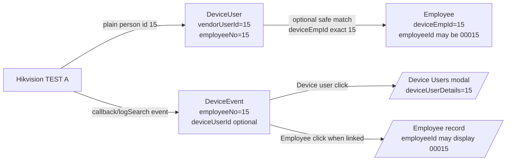
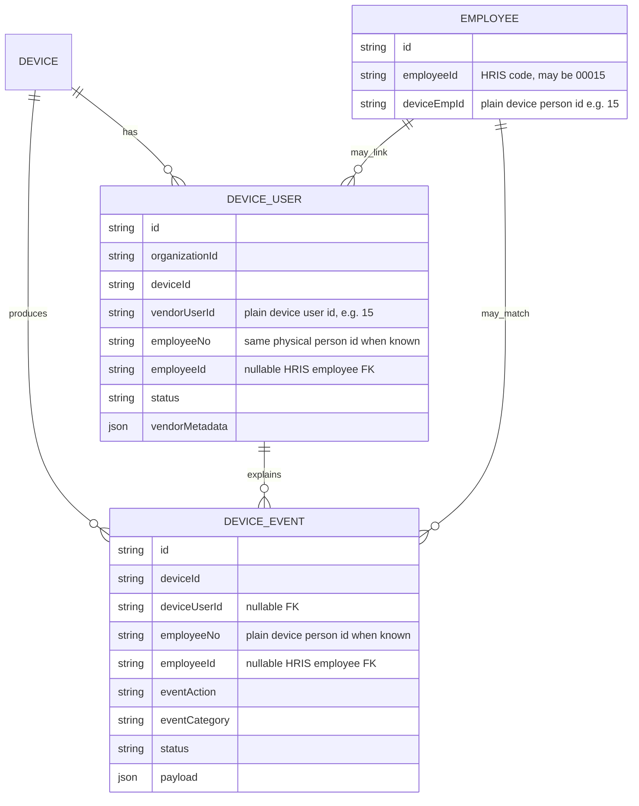
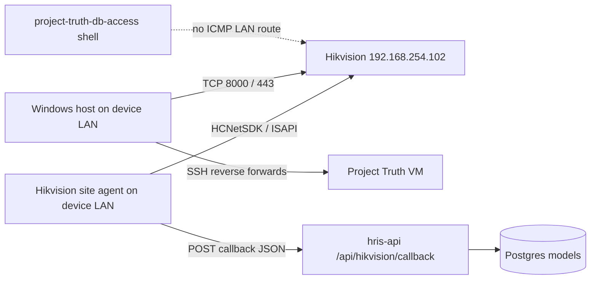
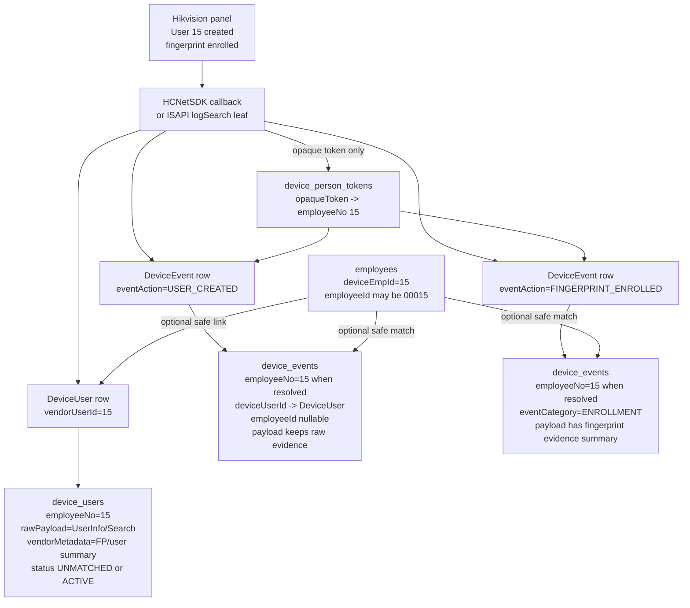
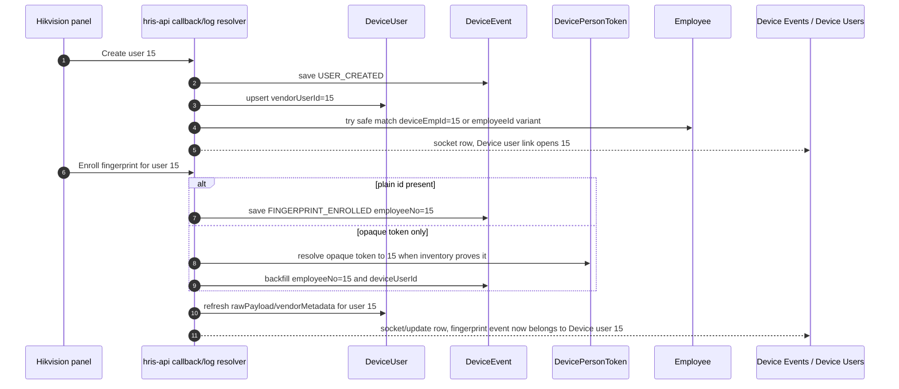

# Hikvision enrollment identity flow (spec + architecture)

**Status:** ACCEPTED local runtime design (2026-07-19)  
**Task mode:** Docs / architecture sync (matches code + live TEST A evidence)  
**Audience:** operators, agents, and implementers working Device Events / Device Users / SDK listener  

This document captures **what you want**, **what the architecture is**, **what the code does today**, and **how to verify the flows stay in sync**.

> **2026-08-24 STALE-ADDRESS NOTICE:** TEST A moved address. Historical examples in this
> document show `192.168.254.102` (and VM `59000`/`59443` as the TEST A reverse pair).
> Live truth since 2026-08-13: TEST A = `192.168.254.109:443` via `127.0.0.1:58080`/`58000`;
> TEST B = `192.168.254.110:443` via `127.0.0.1:58180`/`58100`; VM `59000`/`59443` now belong
> to the Device 5 reverse pair. The identity-flow architecture itself is unchanged.
> Source: `.wwg/wiki/project-truth.md` current-address note (2026-08-13).

---

## 1. What you want (operator vision)

**Source of truth for live events:** HCNetSDK **listener callback only**  
(`POST /api/hikvision/callback`). Not a product poller inventing people.

Three Hikvision → HRIS event families:

| Operator name | Hikvision reality | HRIS action |
|---|---|---|
| **onUserCreate** | User add on panel (op / `addUserInfo` / major=3 then leaf) | DeviceEvent `USER_CREATED` + **DeviceUser** + raw metadata |
| **onEnrollUser** | Fingerprint enroll (`addFp…` / FP management) | DeviceEvent `FINGERPRINT_ENROLLED` + DeviceUser credential refresh |
| **onAttendanceTap** | Access auth pass (major=5) | DeviceEvent `TAP` + Attendance if employee linked. Panel **Select Status** is copied onto the live SDK POST and Device Events; it is **not** used for `timeIn`/`timeOut` yet — see `docs/HIKVISION_SELECT_STATUS_MAPPING.md` |

### Identity model (operator + schema truth)

**`DeviceEvent` has `employeeNo String?` in schema** (`hris-api/prisma/schema/device.prisma`).

| Model field | Example | Meaning |
|---|---|---|
| Panel / DeviceUser.vendorUserId | `15` | Plain device person id |
| DeviceUser.employeeNo | `15` | Same plain id |
| DeviceEvent.employeeNo | `15` | Plain id when resolved |
| **Employee.deviceEmpId** | **`15`** | **Plain — same as device (NOT padded)** |
| Employee.employeeId | `00015` / `01029` | HRIS business code (may show leading zeros) |

Live linked sample: vendor `1029` → `deviceEmpId=1029`, `employeeId=01029`.

```text
Panel "15"
  → DeviceUser.vendorUserId = "15"  + raw UserInfo metadata
  → DeviceEvent.employeeNo  = "15"
  → Employee.deviceEmpId     = "15"     ← match key (exact plain)
  → Employee.employeeId     = "00015"  ← display/org code only
```

| Click | Target |
|---|---|
| Device person `15` | Device Users details `vendorUserId=15` |
| Employee (when linked) | HRIS employee; display may show `employeeId` `00015` |

**Visual HTML:**  
- Identity model: [`docs/hikvision-callback-event-flows.html`](./hikvision-callback-event-flows.html)  
- **Event actions → storage matrix:** [`docs/DEVICE_EVENT_ACTIONS.md`](./DEVICE_EVENT_ACTIONS.md) + [`docs/device-event-actions.html`](./device-event-actions.html)

### onUserCreate — required must-happen list

When person **15** is created on one device:

1. Callback receives create (ACS or major=3 → logSearch on callback path).
2. **DeviceEvent.employeeNo = `"15"`** (field exists on schema).
3. **DeviceUser** `vendorUserId="15"` + raw metadata.
4. **Match** `Employee.deviceEmpId === "15"` (primary). Also allow `employeeId` pad match e.g. `00015` for org codes.
5. No employee → UNMATCHED DeviceUser; still show User 15.
6. Socket + deep-link Device User `15`.

---

## 2. Architecture (correct layers)

```text
 Windows host                              Hyper-V VM                         Hikvision device
 ────────────                              ──────────                         ────────────────
 npm run dev / Keep-ready
   │
   ├─ smart reverse-bridge resolve
   │    DB Device row (TEST A)
   │    + host TCP reachability
   │    → 192.168.254.102
   │
   ├─ SSH reverse (device)
   │    VM:59000 → host → device:8000 (SDK)
   │    VM:59443 → host → device:443  (HTTPS/ISAPI)
   │
   └─ SSH reverse (API socket truth)
        VM:53001 → host:3001

                                         hikvision-biometric-service
                                         (HCNetSDK alarm listener)
                                              │
                                              │ ACS alarm callback
                                              │ major/minor + optional dwEmployeeNo
                                              ▼
                                         POST /api/hikvision/callback
                                         source=EN_HCNETSDK_ALARM
                                              │
                    ┌─────────────────────────┼─────────────────────────┐
                    ▼                         ▼                         ▼
            Save DeviceEvent           Fast identity path          Multipass follow-up
            (always, socket)           (if plain/opaque known)     (if major=3 empty person)
                    │                         │                         │
                    │                         ├─ DeviceUser stub        ├─ logSearch leaves
                    │                         ├─ MATCHED/UNMATCHED      │   USER_CREATED / FP
                    │                         ├─ socket again           ├─ opaque tokens
                    │                         └─ UserInfo enrich        └─ inventory delta
                    │                                                    → plain + DeviceUser
                    ▼
            Browser Device Events
            device-event:saved  (Socket.IO)
```

### What is **not** the architecture

| Misread | Reality |
|---|---|
| “Polling invents enroll people” | No. Live path is **SDK ACS alarm → callback**. Multipass logSearch / inventory is **follow-up evidence** when the SDK packet has no plain person id. |
| “Opaque token = employee number” | No. Opaque tokens are log privacy ids; plain id lives in **UserInfo/Search**. |
| “DeviceUser is the event ledger” | No. **DeviceEvent** = history. **DeviceUser** = current inventory on device. |
| “Listener green = employee matched” | No. Listener green = transport/SDK armed. Matching is a separate HRIS link step. |
| “Host reverse tunnel = VM can ping device LAN” | No. Reverse only exposes chosen TCP ports on VM loopback. |
| “First socket always has plain person id on create/enroll” | **False.** ACS often has `dwEmployeeNo=0` on major=3. C++ must inventory-enrich before POST (2026-07-19 harden), or HRIS multipass later. Trace `alarm_callback` + live payload; do not invent. See `.grok/rules/02-sdk-callback-wire-truth.md`. |

### C++ pre-POST enrich (2026-07-19)

Before `POST /api/hikvision/callback`, `enrich_hris_job_before_post`:

1. If `employeeNo` empty on enroll/op → UserInfo inventory delta (with short retries) → set plain id + `identitySource=inventory_delta`.
2. If plain known and FP/user-management **or major=3 / operation-sync / identity_repost** → read raw fingerprint templates into callback `fingerprints[]` (base64, not AES).
3. If card known → optional `faceTemplate` / `facePicture` base64.
4. Socket/HRIS then receive plain + templates on that same POST when enrich succeeds.

This matches Project Truth principles: **DeviceEvent is saved event truth; DeviceUser is inventory; evidence over assumption.**

### Device FP write stickiness (proven 2026-07-19 TEST A)

| Observation | Evidence |
|---|---|
| `FingerPrintDownload` returns HTTP `statusString=OK` | Common for both rewrite and clone |
| Async `FingerPrintProgress` `cardReaderRecvStatus=6` | Same-person template rewrite can apply |
| `cardReaderRecvStatus=5` + `errorMsg="<donor employeeNo>"` | **Clone of person 15 template onto new person rejected** (device anti-dupe) |
| Re-read `numOfFP` after rejected clone | Stays `0` / Upload status `NoFP` |
| Product rule | **Never treat HTTP OK alone as enrolled.** Never store **donor** templates as the new person's raw custody. Sticky = re-read templates for **that** `employeeNo`. |

Synthetic agent enrolls that **copy another person's fingerData** cannot satisfy hard sticky goal on this device family. Physical panel enroll (unique template) or a write that Progress status=6 + re-read ≥1 is required for F8 sticky on a new person.

---

## 3. Exact event flows (spec to code)

### Flow A — SDK callback already carries plain person id

**When:** ACS alarm includes `dwEmployeeNo > 0` (or typed action with plain `employeeNo` / `employeeNoString`), e.g. some user-management minors.

```text
SDK alarm (employeeNo="15")
  → POST /api/hikvision/callback
  → save DeviceEvent (taxonomy USER_CREATED / FP / …)
  → applyFastEnrollmentIdentityOnSdkCallback
       1) upsert DeviceUser vendorUserId=15 (+ HRIS link 15↔00015 if employee exists)
       2) set event.employeeNo=15, deviceUserId, MATCHED|UNMATCHED
       3) emit device-event:saved   ← socket #1 (plain id now)
       4) background UserInfo/Search → DeviceUser.rawPayload/vendorMetadata
          emit device-event:saved again ← socket #2 (richer metadata)
```

**Code owners**

| Step | Location |
|---|---|
| SDK JSON body | `vendor/hikvision-linux/src/hikvision_bio/acs.cpp` (`build_hikvision_callback_json`) |
| Callback + non-attendance branch | `hris-api/app/hikvision/controller/callback.controller.ts` |
| Fast identity | `applyFastEnrollmentIdentityOnSdkCallback` in `hris-api/helper/device-person-token.helper.ts` |
| DeviceUser UserInfo enrich | `enrichEnrollmentLifecycleEvent` same helper |
| Socket | `emitDeviceEventSaved` → `device-event:saved` |

**Acceptance (Flow A)**

- [ ] HTTP callback returns `enrollmentIdentityPath=plain_immediate` (or `opaque_mapped`) when plain available  
- [ ] DeviceEvent.employeeNo = plain `15`  
- [ ] DeviceUser.vendorUserId = `15`  
- [ ] Socket payload includes `event.employeeNo=15` and optional `event.employee` when linked  
- [ ] Device Events UI shows **User 15** (not “No person id”)  
- [ ] Device Users deep-link `deviceUserDetails=15` opens that row  

---

### Flow B — Panel enroll (common): SDK major=3 signal **without** plain id

**When:** Device fires operation-sync / major=3; first packet often has **empty** `dwEmployeeNo`. Panel create still writes UserInfo with plain `15`, but **operation logs** store an **opaque** token.

```text
SDK major=3 SYNC_SIGNAL (employeeNo empty)
  → POST /api/hikvision/callback
  → save DeviceEvent (RUNTIME / SYNC_SIGNAL) + socket (path alive)
  → scheduleOperationLogResolveAfterSdkSignal (multipass, ~0.2s–25s)
       │
       ├─ ISAPI ContentMgmt/logSearch leaves
       │    addUserInfo / addFpByEmployeeNo / …
       │    → typed DeviceEvent USER_CREATED / FINGERPRINT_ENROLLED
       │    → employeeNo often still EMPTY; payload.opaquePersonToken set
       │    → socket each new lifecycle row
       │
       └─ resolveOpaqueViaDeviceUserInventoryDelta
            UserInfo/Search (enough pages for 300+ users)
            new plains not in HRIS DeviceUser → upsert DeviceUser immediately
            1 opaque + new plain(s) → map highest pure-numeric plain (e.g. 15)
            DevicePersonToken(opaque → "15")
            backfill recent lifecycle events employeeNo=15 + deviceUserId
            enrich UserInfo onto DeviceUser
            socket updated rows
```

**Live evidence (TEST A, 2026-07-19)**

| Observation | Value |
|---|---|
| Panel person | `15` |
| Op log opaque | `QVEwgvx/WIX5uNj9psBnjw==` |
| ISAPI UserInfo | `employeeNo=15`, `numOfFP=1` |
| First events | USER_CREATED + FINGERPRINT_ENROLLED with opaque, no plain |
| After resolve/recover | `employeeNo=15`, DeviceUser `vendorUserId=15` |

**Acceptance (Flow B)**

- [ ] First socket within ~1s of SDK signal (may still say “No person id” briefly)  
- [ ] Typed USER_CREATED / FINGERPRINT_ENROLLED appear from logSearch (seconds)  
- [ ] Within inventory-delta window: DeviceUser `15` exists  
- [ ] Same window: events updated to plain `15` + re-socket  
- [ ] Opaque retained in payload for audit  

---

### Flow C — HRIS-initiated UserInfo write (write-time capture)

**When:** Admin/API creates user via `UserInfo/Record` with known plain id.

```text
POST UserInfo/Record (plain employeeNo known to HRIS)
  → scheduleWriteTimePersonTokenCapture
  → poll logSearch for opaque token
  → DevicePersonToken(opaque → plain) for future callbacks
```

Plain id is already known at write time — best case for “socket with person immediately” if a lifecycle event is also emitted.

---

### Flow D — Attendance tap (not enroll)

```text
SDK major=5 auth pass + employeeNo
  → callback attendance path
  → DeviceUser / deviceEmpId resolve
  → attendance / timesheet projection when matched
  → device-event:saved
```

Enroll identity rules still use the same person-id pad variants for matching.

---

## 4. Sequence diagram (panel enroll of person 15)

```mermaid
sequenceDiagram
  autonumber
  participant Panel as Hikvision panel
  participant SDK as HCNetSDK listener (VM)
  participant API as hris-api callback
  participant DB as Postgres
  participant UI as Device Events (browser)
  participant ISAPI as Device ISAPI

  Panel->>Panel: Create user 15 + enroll FP
  Panel->>SDK: ACS major=3 (often no plain id)
  SDK->>API: POST /api/hikvision/callback
  API->>DB: Insert DeviceEvent SYNC_SIGNAL
  API->>UI: device-event:saved (quick, person may be empty)

  API->>ISAPI: multipass logSearch (addUserInfo, addFp…)
  ISAPI-->>API: leaves with opaque token
  API->>DB: Insert USER_CREATED / FINGERPRINT_ENROLLED (opaque)
  API->>UI: device-event:saved (typed actions)

  API->>ISAPI: UserInfo/Search inventory
  ISAPI-->>API: plain employeeNo=15 (+ numOfFP)
  API->>DB: Upsert DeviceUser vendorUserId=15
  API->>DB: Map opaque→15; update events employeeNo=15
  API->>UI: device-event:saved (User 15)

  Note over UI: Click device person → Device Users details for 15<br/>Click employee (if linked) → HRIS employee 00015
```

---

## 5. Data contracts (sync checklist)

### DeviceEvent (ledger)

| Field | Enroll create/FP target |
|---|---|
| `eventCategory` | `USER_MANAGEMENT` / `ENROLLMENT` |
| `eventAction` | `USER_CREATED` / `USER_UPDATED` / `FINGERPRINT_ENROLLED` / … |
| `employeeNo` | **Plain** device person id when known (`15`) — never leave opaque here once mapped |
| `deviceUserId` | FK to DeviceUser when known |
| `employeeId` | FK to Employee when linked (`deviceEmpId` plain `"15"` match) |
| `payload.opaquePersonToken` | Always keep if seen |
| `payload.resolvedEmployeeNo` | Plain after map |
| `payload.enrollmentSnapshot` / `enrollmentGoal` | Goal-oriented identity + UserInfo summary (no raw FP template bytes) |
| `status` | `MATCHED` if employee linked; else `UNMATCHED` / `RECEIVED` while resolving |

### DeviceUser (inventory)

| Field | Target |
|---|---|
| `vendorUserId` | Plain device id `15` |
| `employeeNo` | Same plain id |
| `rawPayload` | Last UserInfo/Search (or sync) body |
| `vendorMetadata` | Structured vendor summary + optional `opaquePersonToken` + biometric custody pointers |
| `employeeId` | Set when pad-aware link succeeds |

### DevicePersonToken (opaque map)

| Field | Target |
|---|---|
| `opaqueToken` | LogAddInfo token |
| `employeeNo` | Plain `15` |
| `source` | `WRITE_TIME_CAPTURE` / `PANEL_INVENTORY_DELTA` / … |

---

## 6. UI navigation contract

```text
Device Events row
  employeeNo plain "15" (or deviceUser.vendorUserId)
       │
       ├─ "Device user" control
       │     → /admin/configuration/devices?
       │          action=device-users
       │          &deviceId=<TEST A>
       │          &deviceUserSearch=15
       │          &deviceUserDetails=15
       │          &deviceUserView=shown   (Current view for brand-new plains)
       │
       └─ Employee name (only if employeeId linked)
             → employee profile for that HRIS id
             (display code may show 00015)
```

Do **not** use padded `00015` as `deviceUserDetails` — DeviceUser keys are **unpadded device plain ids**.

---

## 7. Runtime path prerequisites (TEST A reverse)

```text
Device row (source of config truth)
  name: TEST A
  address: 192.168.254.102
  transport: ssh-reverse-forward
  sdkPort: 8000
  https: 443

predev / Keep-ready
  resolve-hikvision-vm-bridge-targets.cjs
    → reverse devices from DB + host TCP rank
  ensure-hikvision-vm-bridge.cjs
    → local SSH must match resolved IP (not stale :59000 alone)
  ensure-device-live-path.ps1
    → API reverse VM:53001 → host:3001 (socket truth)
```

Listener modal **armed/receiving** proves transport. Person labels prove identity resolve.

---

## 8. Spec ↔ implementation sync matrix

| Spec intent | Implemented? | Primary code |
|---|---|---|
| SDK callback is the live enroll path | **Yes** | `src/hikvision_bio/acs.cpp` → `/api/hikvision/callback` |
| Quick socket on every saved event | **Yes** | `emitDeviceEventSaved` |
| Plain id on callback when SDK sends it | **Yes** | `applyFastEnrollmentIdentityOnSdkCallback` |
| Panel opaque → plain without inventing ids | **Yes** | logSearch + inventory delta |
| New plain lands on DeviceUser quickly | **Yes** (2026-07-19) | inventory delta upserts new plains before map completes |
| Plain `deviceEmpId === "15"` + optional `employeeId` pad | **Yes** | exact deviceEmpId + pad on employeeId only |
| Raw FP template bytes on create/enroll DeviceEvent | **Yes** (2026-07-19 operator contract) | `payload.rawFingerprints.templates[].data`; DeviceUser remains the inventory custody plane |
| Raw FP template on DeviceUser after enroll | **Yes (operator expectation)** | `vendorMetadata.rawFingerprints.templates[].data` via ISAPI on FINGERPRINT_ENROLLED |
| Device Events click → Device User 15 | **Yes** | deep-link `deviceUserDetails` |
| Employee click → employee record (employeeId may display 00015) | **Yes when linked** | deviceEmpId plain 15 |
| Smart reverse IP after reboot | **Yes** | resolve targets + ensure bridge |
| Always sub-second plain person on panel create | **Partial** | depends on logSearch + UserInfo; often 1–10s after first socket |

---

## 9. Gaps / honest boundaries

1. **Panel create does not guarantee plain id on the first SDK packet.** Device firmware often sends major=3 without `dwEmployeeNo`. Spec accepts a short “path alive” row first, then plain id on resolve.
2. **If inventory delta cannot uniquely map opaque → plain** (many new users at once), events may stay opaque until Sync device users or a later delta.
3. **No Employee row with deviceEmpId `15`** means DeviceUser stays **UNMATCHED** even when plain `15` is correct.
4. **Search box “15”** also matches `01515`, etc.; use `vendorUserId=15` or deep-link for exact open.
5. **Listener STATUS UNREACHABLE** in Sync Center vs green Device Events strip means two different status probes — do not treat them as the same truth without checking the same endpoint.

---

## 10. How to re-verify the vision end-to-end

```powershell
# 1) Health + login
# 2) Create person N on panel + enroll FP
# 3) Device Events: expect socket rows within seconds
# 4) API proof

$login = Invoke-RestMethod -Method Post 'http://localhost:3001/api/auth/login' `
  -ContentType 'application/json' `
  -Body (@{ email='admin@bandai.local'; password='password123'; appCode='hris' } | ConvertTo-Json)
$h = @{ Authorization = "Bearer $($login.data.token)" }

# Recent USER_CREATED for TEST A device id
Invoke-RestMethod -Headers $h -Uri 'http://localhost:3001/api/device/events?page=1&limit=5&eventAction=USER_CREATED&deviceId=<TEST_A_ID>'

# Exact DeviceUser
Invoke-RestMethod -Headers $h -Uri 'http://localhost:3001/api/device/<TEST_A_ID>/users?vendorUserId=15'

# Device still has plain 15
# POST /api/hikvision/access-control/user-info/search with EmployeeNoList employeeNo=15
```

**Pass criteria for one enroll**

1. Socket or refresh shows USER_CREATED and/or FINGERPRINT_ENROLLED.  
2. Within resolve window: `employeeNo` plain on those events.  
3. `GET .../users?vendorUserId=<plain>` returns one row.  
4. Device user deep-link opens that row.  
5. If `Employee.deviceEmpId` equals the plain device id, or `Employee.employeeId` matches an accepted padded org-code variant, event/DeviceUser become MATCHED/ACTIVE.

---

## 11. Related docs & code map

| Doc / path | Role |
|---|---|
| This file | Enrollment identity **spec + diagrams** |
| `.wwg/wiki/05-architecture/hikvision-enrollment-identity-architecture.md` | WWG architecture twin |
| `.wwg/wiki/05-architecture/hikvision-biometric-sync-architecture.md` | Biometric peer-sync target architecture |
| `docs/HIKVISION_RUNTIME_TRUTH.md` | Broader runtime evidence |
| `hris-api/helper/device-person-token.helper.ts` | Opaque map, inventory delta, fast identity |
| `hris-api/helper/device-user-sync.helper.ts` | Pad candidates + link decision |
| `hris-api/app/hikvision/controller/callback.controller.ts` | Callback orchestration |
| `vendor/hikvision-linux/src/hikvision_bio/acs.cpp` | SDK `alarm_callback` / `build_hikvision_callback_json` → HRIS post |

---

## 12. Decision record

| Decision | Choice | Why |
|---|---|---|
| Ledger vs inventory | DeviceEvent vs DeviceUser | History must not be overwritten by current inventory; inventory must not invent lifecycle |
| Opaque handling | Side table + payload keep | Device will not reverse-lookup opaque as employeeNo |
| Pad rule | Keep `deviceEmpId` plain; allow padded `employeeId` display/match variants | Device keys stay physical; HRIS business codes may carry leading zeros |
| Socket timing | Emit early, re-emit on resolve | Operator sees liveness immediately |
| Plain source of truth for person | UserInfo/Search plain id | Op logs are not the person label |

**Architecture verdict:** Your vision is **correct** and aligned with Project Truth. The implementation is **synced for the happy and panel-opaque paths** as of 2026-07-19, with the explicit boundary that plain id may trail the first socket by a few seconds on panel enroll when the SDK does not put `dwEmployeeNo` on the first alarm.

---

## 13. Modal/click architecture for person 15

This is the exact rule for the Device Events modal and Device Users modal:

```text
Device person 15
  -> DeviceUser.vendorUserId = "15"
  -> DeviceEvent.employeeNo = "15" when resolved
  -> Device Events "Device user" click opens Device User 15

HRIS employee linked to that device person
  -> Employee.deviceEmpId = "15" (plain, same as device)
  -> Employee.employeeId may be "00015" (display/org code)
  -> Device Events "Employee" click opens the HRIS employee record
```

The architecture is correct only if these two links remain separate. Never pad `deviceUserDetails` to `00015`. Never treat `deviceEmpId` as padded.



### Data model diagram



### Modal decision table

| User action / data state | Correct behavior | Incorrect behavior to prevent |
|---|---|---|
| Device Events row has `employeeNo=15` and/or `deviceUserVendorUserId=15` | Show a Device user action and deep-link with `deviceUserDetails=15`. | Padding to `deviceUserDetails=00015`. |
| Device Events row is missing `deviceUserId` but has plain `employeeNo=15` | API should resolve/fallback by `(organizationId, deviceId, vendorUserId=15)` so the row can still open Device User 15. | Leaving the row as permanently unknown when DeviceUser 15 exists. |
| DeviceUser 15 is linked to Employee with `deviceEmpId=15` (employeeId may be `00015`) | Employee action opens the employee profile; employee UI may display `00015`. | Using the employee route when the user clicked Device user. |
| Callback/logSearch only has an opaque token | Keep opaque in payload and resolve through `DevicePersonToken` plus UserInfo inventory delta. | Displaying the opaque token as employee no. |
| DeviceUser 15 exists but no safe Employee match exists | Show DeviceUser 15 as `UNMATCHED`; allow admin/manual link later. | Fabricating an Employee match by padding alone when multiple/unsafe matches exist. |

### Implementation owners for this contract

| Layer | File | Contract |
|---|---|---|
| Saved event query | `hris-api/app/device/device.controller.ts` | Joins `DeviceEvent` to `DeviceUser` by FK, or by `(organizationId, deviceId, employeeNo/vendorUserId)` fallback for older rows. |
| Callback identity | `hris-api/helper/device-person-token.helper.ts` | Preserves plain device person id and maps opaque tokens only with evidence. |
| Device user matching | `hris-api/helper/device-user-sync.helper.ts` | Builds pad-aware employee candidates without rewriting `DeviceUser.vendorUserId`. |
| Device Events UI | `hris-app/app/routes/admin/devices/events.tsx` | Separates Device user navigation from Employee navigation. |
| Device Users modal | `hris-app/app/routes/admin/devices/enroll.tsx` | Opens details by plain `vendorUserId`, such as `15`. |
| Regression proof | `hris-app/tests/smoke/admin-device-events-sync-modal.spec.ts` | Ensures Device user stays `15` while employee identity may be padded. |

---

## 14. Why `project-truth-db-access` cannot ping TEST A

Observed command:

```text
infra@project-truth-node:~$ ping 192.168.254.102
From 61.245.16.174 icmp_seq=1 Time to live exceeded
From 61.245.16.174 icmp_seq=2 Time to live exceeded
```

This means the shell is not reaching the private Hikvision LAN directly. The packet is escaping toward an upstream/public route and looping or expiring at `61.245.16.174`. That is a network route symptom, not proof that the Hikvision device is down and not proof that HRIS storage failed.

Important distinction:

```text
DB Access / Cloudflare / SSH helper
  Good for: database/admin tunnel access to Project Truth
  Not good for: ICMP ping to 192.168.254.102

SSH reverse bridge
  Good for: selected TCP ports only
    VM:59000 -> host -> 192.168.254.102:8000  (HCNetSDK)
    VM:59443 -> host -> 192.168.254.102:443   (ISAPI/HTTPS)
  Not good for: general LAN routing or ping

Site agent on same LAN as device
  Good for: real device reachability, SDK alarm listener, ISAPI reads
  Posts back to: /api/hikvision/callback
```

So the expected architecture is not "make `project-truth-db-access` ping the panel." The expected architecture is:



If you need to prove device reachability from that shell, test the actual forwarded TCP target, not ICMP to the private device IP. Ping is only valid from a machine actually on `192.168.254.0/24`.

---

## 15. What gets stored when user 15 is created and fingerprint enrolled

### Real model storage map



### On user create

When the panel creates person `15`, HRIS should create or update:

| Table/model | Row created or updated | Important stored fields |
|---|---|---|
| `device_events` / `DeviceEvent` | One saved history row for user creation | `eventAction=USER_CREATED`, `eventCategory=USER_MANAGEMENT`, `employeeNo=15` when resolved, `deviceUserId` when linked to DeviceUser, `employeeId` only if HRIS employee safely matches, `payload` with raw callback/logSearch evidence, `dedupeKey` to avoid duplicate saves. |
| `device_users` / `DeviceUser` | One current identity row for person-on-device | `vendorUserId=15`, `employeeNo=15`, `deviceId=<TEST A>`, `status=UNMATCHED` if no Employee link or `ACTIVE`/linked status when matched, `rawPayload` from UserInfo/Search, `vendorMetadata` with vendor/user summary. |
| `employees` / `Employee` | Usually not created by device callback | Existing Employee may be linked by `deviceEmpId=15`; `employeeId` may display as `00015`. |
| `device_person_tokens` / `DevicePersonToken` | Only when Hikvision logSearch gives an opaque token | `opaqueToken=<base64/log token>`, `employeeNo=15`, `source=WRITE_TIME_CAPTURE` or inventory-delta source. |

### On fingerprint enroll

When the fingerprint is enrolled for the same person `15`, HRIS should create or update:

| Table/model | Row created or updated | Important stored fields |
|---|---|---|
| `device_events` / `DeviceEvent` | A second saved history row for fingerprint lifecycle | `eventAction=FINGERPRINT_ENROLLED`, `eventCategory=ENROLLMENT`, `employeeNo=15` when resolved, `deviceUserId` pointing to DeviceUser 15, and usable raw templates at `payload.rawFingerprints.templates[].data` after callback or automatic ISAPI capture. |
| `device_users` / `DeviceUser` | Same DeviceUser 15 updated/refreshed | `vendorMetadata` / `rawPayload` updated from UserInfo/Search (counts) **and** raw fingerprint templates at `vendorMetadata.rawFingerprints.templates[].data` (base64 finger template blobs, not AES-wrapped by default). Capture runs automatically after FINGERPRINT_ENROLLED enrich via ISAPI FingerPrintUpload. |
| `device_person_tokens` / `DevicePersonToken` | Maybe updated | Used only if the fingerprint operation log has an opaque token that needs mapping back to `15`. |
| `employees` / `Employee` | Not created by fingerprint enroll | Existing linked employee remains linked; no employee should be fabricated from fingerprint evidence alone. |

So the expected storage split is:

```text
FINGERPRINT_ENROLLED event row
  stores: proof that fingerprint enrollment happened
  stores: callback/log evidence + enrollment summary + rawFingerprintCustody status
  stores: full usable base64 templates at payload.rawFingerprints.templates[].data

DeviceUser 15 row (operator expectation — viewable here)
  stores: current user identity and UserInfo raw metadata
  stores: fingerprint count/status from UserInfo/Search
  stores: RAW base64 templates at vendorMetadata.rawFingerprints.templates[].data
           (and rawPayload._hrisDeviceMetadata.rawFingerprints)

DeviceUser.vendorMetadata.rawFingerprints
  present: true
  fingerprintCount: 1
  templates: [ { fingerPrintId, fingerType, length, data: "<base64 template>" } ]
  source: isapi_FingerPrintUpload_on_enroll
```

After FINGERPRINT_ENROLLED, enrich runs UserInfo then schedules ISAPI FingerPrintUpload to pull actual templates and persist them **raw** on DeviceUser and the create/enroll DeviceEvent payload. Device user details therefore shows the blob without a manual Capture action; Capture remains a repair tool.

### Sequence for the UI



### The mental model

```text
DeviceUser = "who currently exists on this physical panel?"
DeviceEvent = "what happened, when, and from what evidence?"
DevicePersonToken = "how do we translate Hikvision's opaque operation-log token?"
Employee = "which HRIS person, if any, owns that device identity?"
```

That is why creating user `15` and enrolling a fingerprint can produce two DeviceEvent rows but only one DeviceUser row. The user row is the current identity; the event rows are the history.
